# Web Backlinker V2.1 架构图版说明

> 当前 repo 的运行方式、状态契约、站点案例和维护入口，请先看 [README.md](README.md) 与 [docs/](docs/) 下文档。
> 这份文件继续保留为 `north star` 图版说明，不等价于当前代码实现细节。
> 当前 repo 的默认实现已经是 unattended-first：新站默认 `scout -> agent-driven browser-use CLI -> Playwright evidence finalization`，`WAITING_POLICY_DECISION / WAITING_MANUAL_AUTH / WAITING_MISSING_INPUT` 仅作为审计终态使用。

> 用途：给技术合伙人、架构师、工程负责人快速看懂 Web Backlinker V2.1。
>
> 建议搭配阅读：
> - `references/technical-architecture-zh.md`：完整文字版
> - `references/architecture.md`：英文概览版
>
> 阅读顺序建议：
> 1. 先看“系统全景图”
> 2. 再看“主执行时序图”
> 3. 再看“Page Understanding 升级回路”
> 4. 最后看“状态机”和“无人值守运维图”

---

## 1. 系统全景图

这个图回答一个问题：**整套系统由哪些层组成，它们之间怎么协作。**

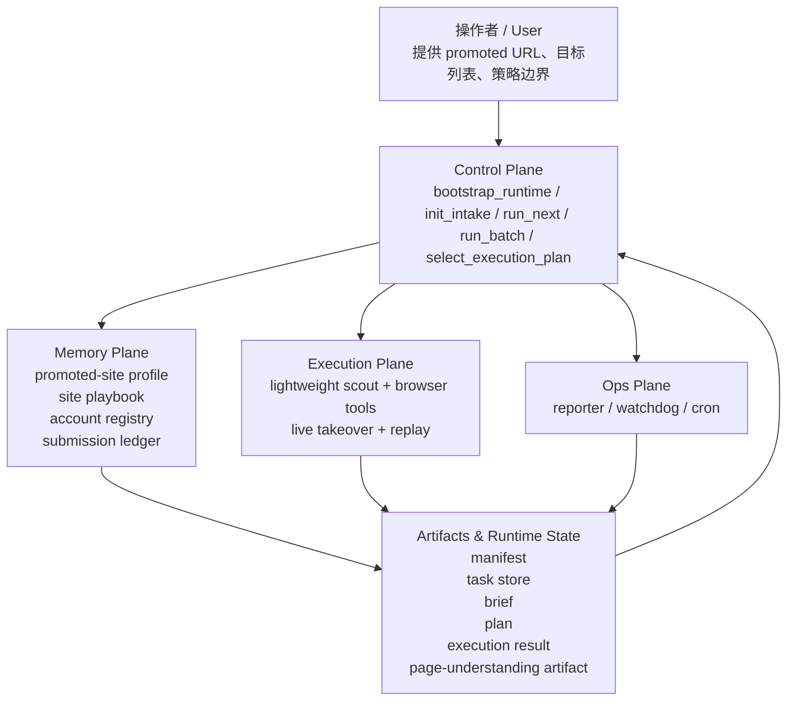

### 图解

- **Control Plane** 是大脑，负责编排，不直接负责浏览器细节。
- **Memory Plane** 负责“下次更便宜”，把一次成功沉淀为长期资产。
- **Execution Plane** 负责轻量侦察、轨迹复放、以及最终兜底层浏览器接管。
- **Ops Plane** 负责无人值守运行时的汇报、监控和恢复。
- **Artifacts & Runtime State** 是这套系统的“外部记忆”和“运行真相源”。

---

## 2. 控制面 + 记忆面 + 执行面的详细模块图

这个图更细地展示主要脚本和核心模块。

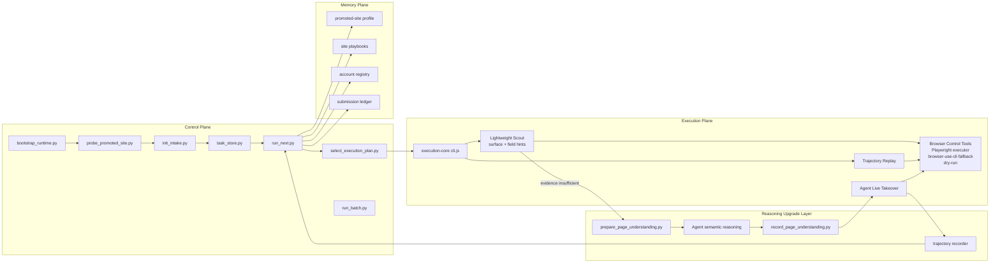

### 图解

- `run_next.py` 是主协调器。
- `task_store.py` 是任务状态机核心。
- `select_execution_plan.py` 是路线选择器。
- `execution-core` 是浏览器执行层。
- 当低成本证据不足时，先进入 **Reasoning Upgrade Layer**，再按需要升级到 **Agent Live Takeover**。

---

## 3. 四层记忆结构图

这个图回答：**系统到底记什么，为什么后续运行会越来越便宜。**

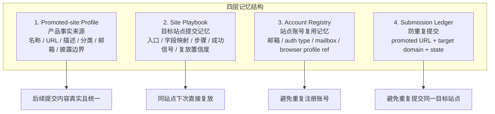

### 图解

- **Profile** 解决“写什么”。
- **Playbook** 解决“怎么做”。
- **Account Registry** 解决“用哪个账号做”。
- **Ledger** 解决“还要不要做”。

---

## 4. 运行目录与数据落盘图

这个图回答：**这些状态和资产实际存在哪。**

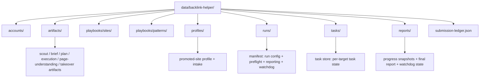

### 图解

这套系统不是把状态藏在会话里，而是**显式落盘**。这样才有：
- 断点恢复能力
- 多轮运行复用能力
- watchdog 可观测性
- 事后审计能力

---

## 5. 主执行流程图（业务主线）

这个图回答：**一轮 campaign 从启动到持续推进，主流程是怎样的。**

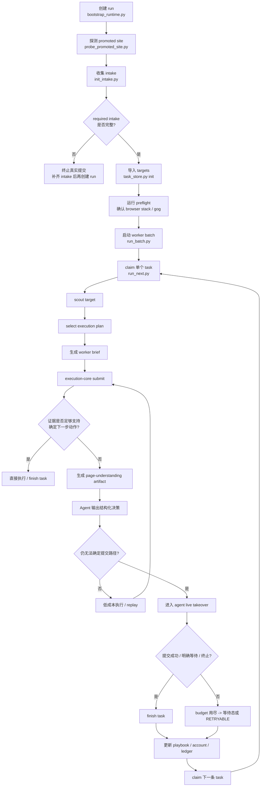

### 图解

这条主线有两个非常关键的设计点：

1. **不是一次跑完整批，而是按单 task 推进。**
2. **不是一开始就让 Agent 接管，而是先用便宜证据和 artifact，最后才升级到 bounded takeover。**

---

## 6. 单任务执行时序图

这个图回答：**一个 task 从 claim 到 finish 的时序是怎样的。**

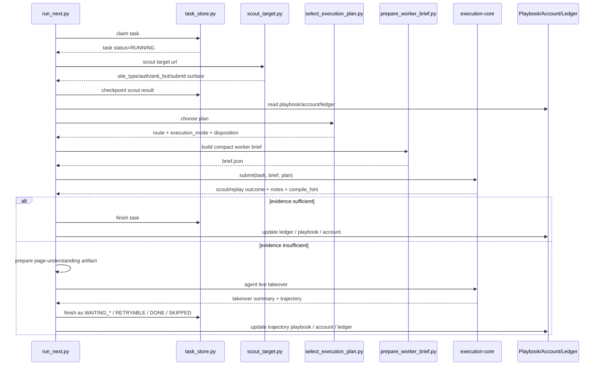

### 图解

主执行链条不是“浏览器脚本”，而是：

> **状态机 + 侦察 + 规划 + bounded takeover + 记忆更新**

---

## 7. 路由选择决策图

这个图回答：**系统如何决定下一步该走哪条路。**

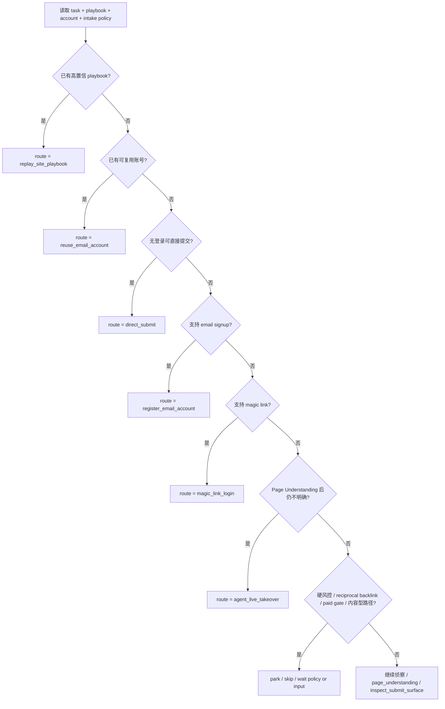

### 图解

这个图背后的原则是：
- **先复用，再探索**
- **先轻路径，再重路径**
- **业务决策和安全风险不自动拍板**

---

## 8. 浏览器执行架构图

这个图回答：**为什么系统要把 scout、browser control、takeover、replay 分层。**

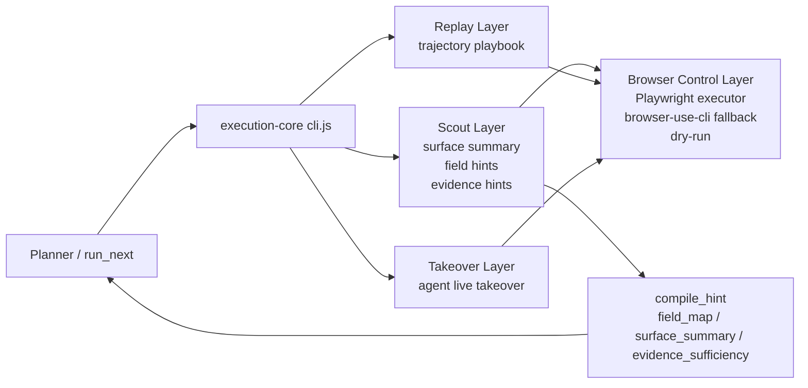

### 图解

- **Scout** 关注页面/站点的低成本侦察。
- **Provider** 关注浏览器执行方式。
- **Replay** 关注成功轨迹复放。
- **Takeover** 关注最终兜底层浏览器接管。
- `compile_hint` 把执行层观察到的证据反馈回控制面。

这使系统具备“可升级”和“可替换”能力。

---

## 9. Evidence Sufficiency 升级决策图

这个图回答：**什么时候升级到 Agent 看 live page。**

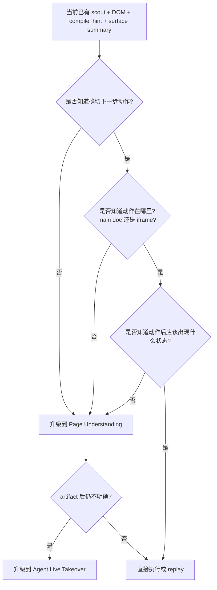

### 图解

这张图是 V2 最重要的抽象之一。

系统不是靠异常白名单来决定升级，而是靠这三个问题：
1. 下一步动作是否明确？
2. 动作位置是否明确？
3. 动作后的预期状态是否明确？

只要有一个不明确，就升级；artifact 之后还不明确，就进入 live takeover。

---

## 10. Page Understanding 升级回路图

这个图回答：**复杂页面时，Agent 是怎么先做语义整理，再在最终兜底层接管浏览器的。**

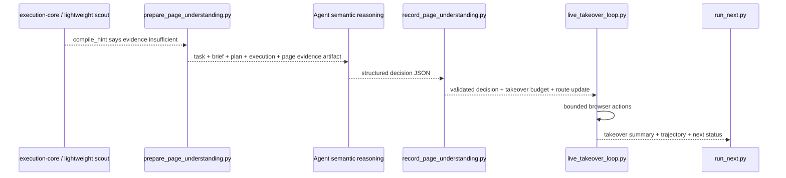

### 图解

这里最关键的是：
- Agent 先输出**结构化决策**，而不是直接乱跑
- takeover 只在预算内接管
- 执行完后必须回到主状态机并留下轨迹

这样既提高完成率，又不失去工程上的可控性。

---

## 11. Lightweight Scout 页面理解图

这个图回答：**轻量侦察层大致是怎么理解页面的。**

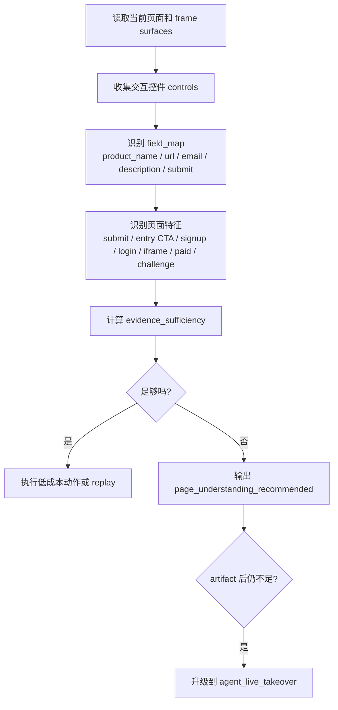

### 图解

轻量侦察层并不是“瞎猜字段然后点提交”。

它做的是一个轻量版页面建模：
- 识别字段
- 识别按钮
- 区分 entry CTA 和 final submit
- 区分 registration surface 和 login surface
- 识别 iframe 嵌入表单
- 判断当前证据是否足够

---

## 12. 任务状态机图

这个图回答：**一个 task 在生命周期里有哪些状态，如何流转。**

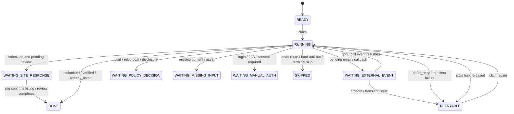

### 图解

状态机设计的核心不是“优雅”，而是“可恢复”：
- 每个状态都有明确语义
- 自动等待、业务决策、缺输入、人工认证、站点审核各自独立
- stale RUNNING 能被回收
- 单 task 的失败不拖垮整 run

---

## 13. Run 级 batch worker 图

这个图回答：**为什么系统用小批次串行 worker，而不是一个长会话无限跑。**

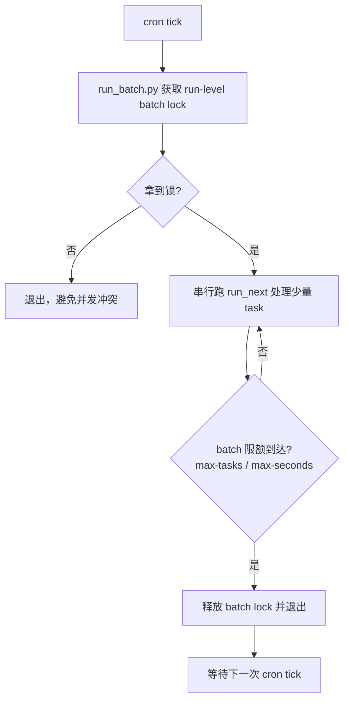

### 图解

这套 batch 设计解决三个问题：
- 防止同一 run 被重叠 worker 并发污染
- 防止单次 turn 无限膨胀
- 让 watchdog 更容易判断“到底是真在跑，还是卡死了”

---

## 14. Reporter + Watchdog 无人值守运维图

这个图回答：**为什么 worker、reporter、watchdog 必须拆开。**

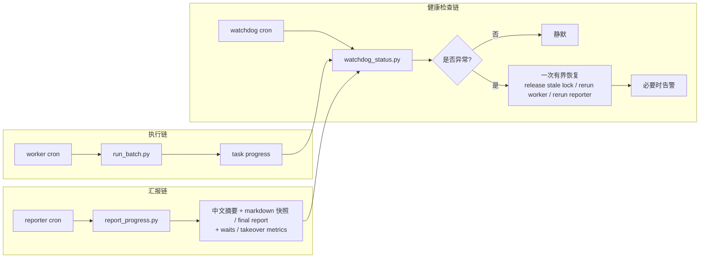

### 图解

拆开的好处：
- worker 只负责干活
- reporter 只负责汇报
- watchdog 只负责查健康和补救

如果把三者塞成一个 job，系统会非常脆弱。

---

## 15. Watchdog 决策图

这个图回答：**watchdog 实际上怎么判断要不要干预。**

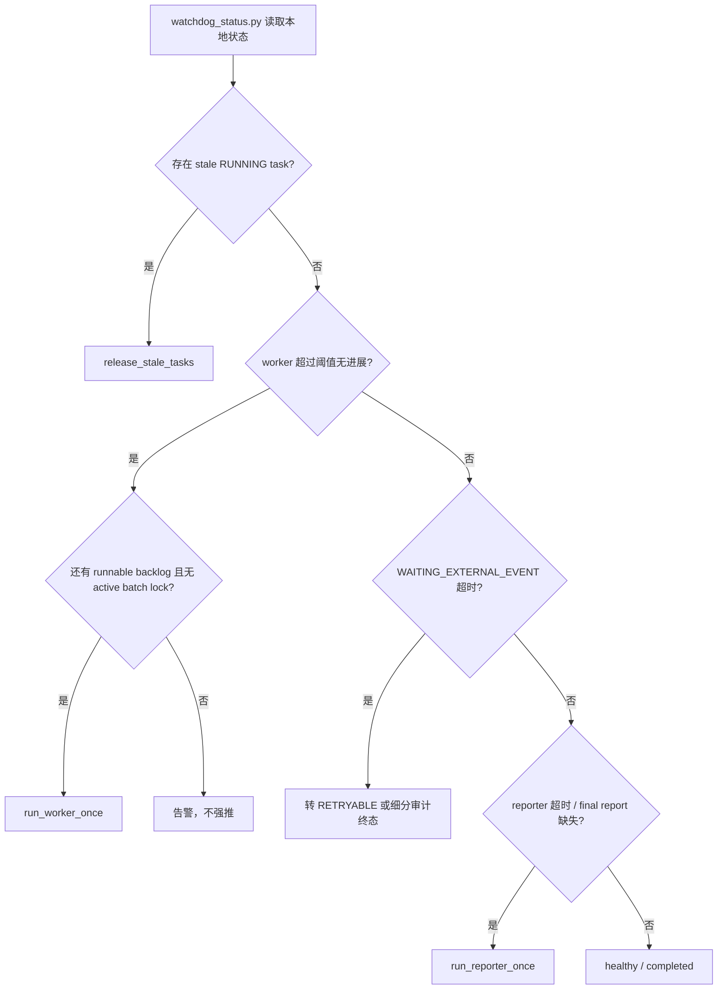

### 图解

watchdog 的关键词只有两个：
- **bounded**
- **silent when healthy**

它不是来刷存在感的，而是来避免静默停摆的。

---

## 16. 为什么这套图体现的是“系统”而不是“脚本”

如果把上面的图连起来看，会发现 Web Backlinker V2.1 的本质不是某个 submit 自动化脚本，而是一个完整执行系统：

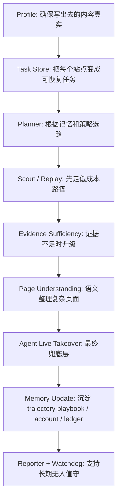

### 一句话总结

> Web Backlinker V2.1 的关键不是“自动填写表单”，而是：
> **把目录站提交这件事，做成一个有记忆、有状态机、有升级机制、有轨迹复用、有运维闭环的工程系统。**

---

## 17. 给合作伙伴的 30 秒版本

如果你要把这个架构快速讲给别人听，可以直接用下面这段：

> 我们这套 Web Backlinker V2.1，不是普通 browser automation。它把每个目标站点当成一个可恢复任务来跑，用 task store 管状态，用 promoted-site profile、trajectory playbook、account registry、submission ledger 四层记忆做长期复用。默认先用便宜证据和 Page Understanding 缩小搜索空间，只有当这些仍不足以支持提交时，才升级到有预算、有轨迹的 Agent live takeover。再加上细分等待态、独立 reporter 和 watchdog，所以它不是一次性脚本，而是一套可长期无人值守、但仍可控可恢复、并且完成率优先的外链提交流水线。
